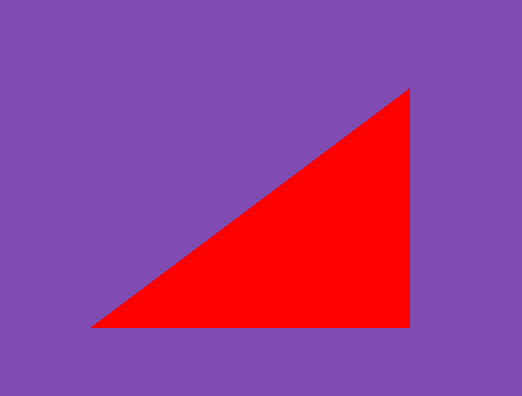
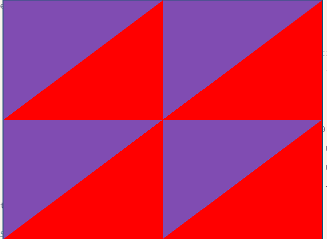
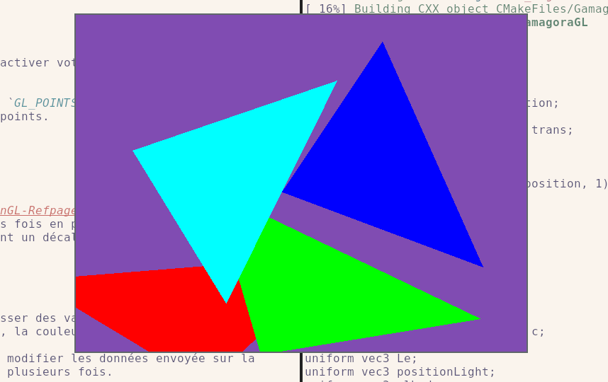
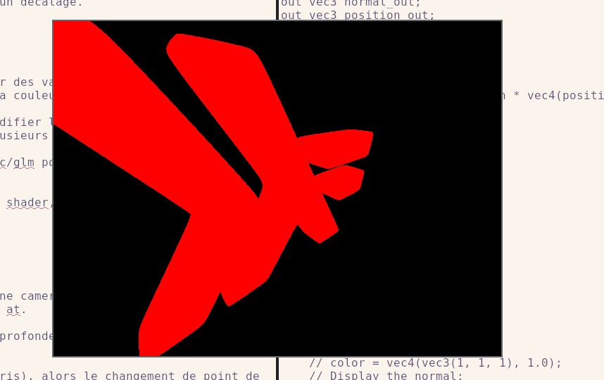
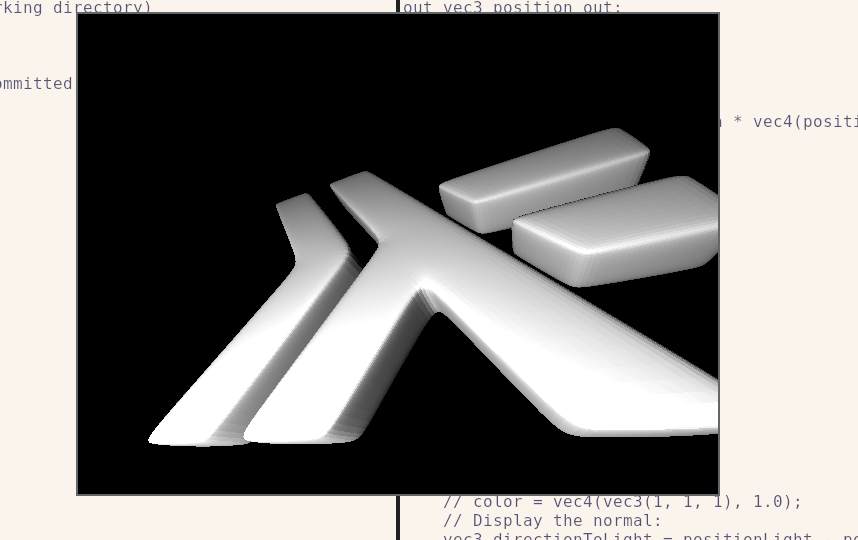

## OpenGL tutorial

Ceci est un tutorial OpenGL très peu guidé. Il est à votre charge de trouver l'information sur internet (hint: vous pouvez ouvrir une merge request sur ce repo pour ajouter des références).

Cependant, chaque étape aura des copies d'écran / animation pour montrer l'état final rechercher et ainsi vous permettre une auto-validation.

N'oubliez pas de demander de l'aide à votre enseignant, parce que sinon, allez lire https://learnopengl.com/ parce que vous n'avez pas besoin de moi pour bosser toutE seulE.

# Ecran noir

En utilisant une libraire de context OpenGL, comme https://www.glfw.org/, et un outil comme GLAD (https://glad.dav1d.de/) ou GLEW, ou ce que vous voulez d'autre dans n'importe quel langage, ouvrez une fenetre OpenGL.

Vous pouvez vous assurer que c'est bon en utilisant:

```c++
glGetString(GL_VERSION)
```

Utilisez de préférence un context OpenGL récent, comme 4.6.

Je vous conseil d'activer le debug callback d'opengl:

```
    glDebugMessageCallback(opengl_error_callback, nullptr);
    glEnable(GL_DEBUG_OUTPUT_SYNCHRONOUS);
```

Il faudra avoir au préalable crée un context de debug.

C'est aussi le moment de chercher un outil de debug opengl, comme apitrace, https://github.com/apitrace/apitrace, ou https://github.com/baldurk/renderdoc

Note: utilisez render doc sur vos vrais application OpenGL / Vulkan / DirectX, c'est toujours amusant de voir comment c'est fait.

# Premier triangle

Pour afficher un triangle, il faut:

- Définir des données pour votre triangle, quelque chose du genre:

```c++
   std::vector<glm::vec3> points{
      {0.5, 0.5, 0},
      ...
   };

```

- Remplir un buffer [gl(Named)BufferData](https://registry.khronos.org/OpenGL-Refpages/gl4/html/glBufferData.xhtml)
- Parametre un VertexBufferArray

La séquence peut ressembler à:

```c++
GLuint vbo, vao;
glGenBuffers(1, &vbo);
glGenVertexArrays(1, &vao);
glBindVertexArray(vao);
glBindBuffer(GL_ARRAY_BUFFER, vbo);
glBufferData(GL_ARRAY_BUFFER, nTriangles * sizeof(TriangleWithNormal), tris.data(), GL_STATIC_DRAW);

// Bindings
const auto index = glGetAttribLocation(program, "position");

glVertexAttribPointer(index, 3, GL_FLOAT, GL_FALSE, 2 * sizeof(glm::vec3), nullptr);
glEnableVertexAttribArray(index);
```

- Créer votre shader, le vertex shader ne fera rien que copier la position dans `gl_Position`, et le fragment shader mettra une couleur. Quelques chose du genre:


```glsl
in vec3 positionq

void main()
{
  gl_Position = vec4(position, 1.0);
}
```

```glsl
out vec4 color;

void main()
{
   color = vec4(1.0, 0.0, 0.0, 1.0);
}
```

Attention à bien configurer `glViewport`, à bien activer votre vertexBuffeArray et votre shader avant de faire `glDrawArrays`.

Si vous avez des soucis, vous pouvez afficher des `GL_POINTS` et utiliser `glPointSize(20)` par exemple pour avoir de gros points.




# Plusieurs triangles

Avec [glUniform](https://registry.khronos.org/OpenGL-Refpages/gl4/html/glUniform.xhtml), vous pouvez appeler votre `glDrawArrays` plusieurs fois en passant une valeur differente. Par exemple, vous pouvez passer un `vec2` contenant un décalage.



# Avec des animations

Toujours en utilisant `glUniform`, vous pouvez passer des valeurs animées en fonction du temps, pour animer la position, la transformation, la couleur.

Le but est de se rendre compte que on peut ne pas modifier les données envoyée sur la carte (i.e. `glBufferData`) et utiliser celles-ci plusieurs fois.

Vous pouvez utiliser la lib https://github.com/g-truc/glm pour les transformations de matrice.

Attention, quand vous utiliser les `mat4` dans votre shader, il faut bien composer la matrice à gauche du `vec4`.



# Avec de la perspective

Faites une scène avec un plan et un cube et mettez une camera, vous pourrez utiliser les fonctions de matrice de glm comme perspective / look at.

L'effet "3D" ne pourra être rendu qu'un activant la profondeur, avec `glEnable(GL_DEPTH_TEST)`.

Si vous permettez à la caméra de bouger (avec la souris), ou si vous animez l'objet, alors le changement de point de vue va vous demander de nettoyer le buffer de profondeur (`glClearBuffer`).

Dans l'animation suivante, j'ai chargé un peu plus de triangle qu'au départ (i.e. `glBuffeData` et `glDrawArray` doivent changer), et j'ai positionné une caméra avec de la perspective.



# Maillage plus sympa

Utiliser une librairie pour charger des maillages, type stl, ou obj (plus sympa, avec les uv, les normales, ...). Il vous faudra peux-être regarder le rendu indexé et les buffers d'index.

# Lighting

Dans votre fragment shader, la question est "quelle est la couleur de ce pixel".

- Ajoutez un uniform correspondant à la position de la lampe
- Ajouter un `out` dans le vertex shader avec la position de l'objet dans l'espace de la scene
- Ajouter un `in` dans le fragment shader avec cette même position
- Connaissant la position de la lampe et du fragment dans le même espace, vous pouvez faire un calcul de lumière:

$$L_o(x, w_o) = \frac {L_{lampe} (w_i . n)} {| p_{lampe} - x} | ^ 2$$

Ici, il nous manque juste la normale $n$.

# Lighting avec la normal

- Ajouter la normal de vos triangles dans votre buffer
- Prenez celle-ci en compte dans le vertex shader (`in` -> `out`)
- Dans le fragment shader, utilisez la valeur interpolée.



# Faites un jeu

Faites un jeu. Avec des assets qui ont un lighting sympa, genre:

- normal map
- diffuse / glossy component (regardez les textures et les uvst)
- plusieurs lampes ?

Pour l'instant on ne sait pas gerer les ombres / reflexions, ... Le but c'est de jouer avec tout cela.


# Textures

- create a texture:

```cpp
GLuint tex;
glCreateTextures(GL_TEXTURE_2D, 1, &tex);
glTextureStorage2D(tex, 1, GL_RGB8, im.width, im.height);
```

- Note: watch for `glGenTextures`, this is the old API and comes with many drawback. Use a debugger (such as `apitrace` and the debug output)
- Note: discussion on texture level, sampling, `glGenerateMipmaps`.

- fill it and bind it.

```cpp
glTextureSubImage2D(tex, 0, 0, 0, im.width, im.height, GL_RGB, GL_UNSIGNED_BYTE, im.data.data());
glBindTextureUnit(texUnit, tex);
```

Note: discussion on texture units

- Use it in a shader:


```glsl
layout(binding=texUnit) uniform sampler2D tex;
```

or

```cpp
auto id = glGetUniformLocation(prog, "tex");
glUniform1i(id, texUnit);
```


```glsl
texelFetch(tex, ivec2(gl_FragCoord.xy), 0)

// or

texture(tex, uv);
```

For the next session, have fun with textures. Add many of them. Draw quads, with texture on it. Try to load advanced meshes (using tinyply, or anything else) and put texture on them using the UV.


# Framebuffer

Next. We'll see framebuffer indirect rendering and clipping.


```cpp
	// FB
	GLuint fbo;
	glCreateFramebuffers(1, &fbo);
```

```cpp
	GLuint ct;
	glCreateTextures(GL_TEXTURE_2D, 1, &ct);
	glTextureStorage2D(ct, 1, GL_RGB8, im.width, im.height);

	GLuint dt;
	glCreateTextures(GL_TEXTURE_2D, 1, &dt);
	glTextureStorage2D(dt, 1, GL_DEPTH_COMPONENT32F, im.width, im.height);

	glNamedFramebufferTexture(fbo, GL_COLOR_ATTACHMENT0, ct, 0);
	glNamedFramebufferTexture(fbo, GL_DEPTH_ATTACHMENT, dt, 0);
```

```cpp
	glBindFramebuffer(GL_DRAW_FRAMEBUFFER, fbo);
```

This allows the creation of an indirect framebuffer. You will be able to render on a texture.

Carefully check your OpenGL errors.

# Ombres

TBD

# Portal

TBD
